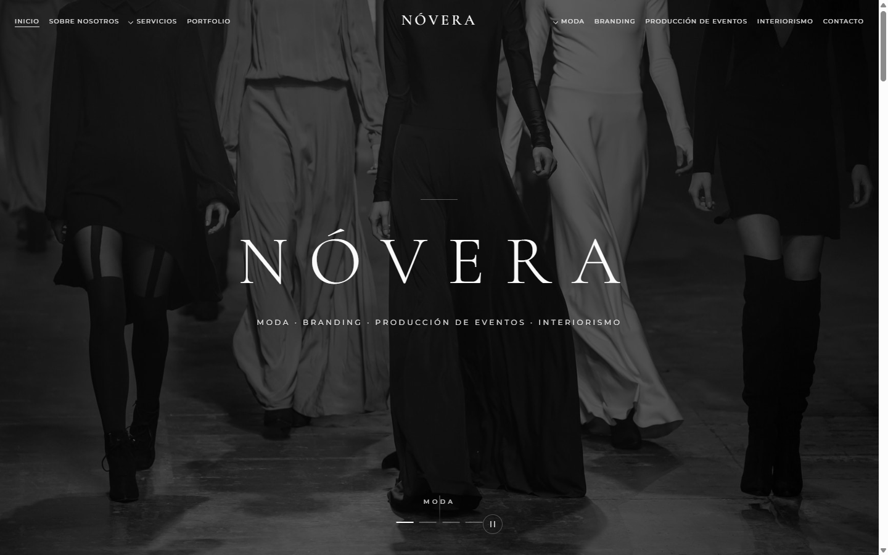

# Web Ejemplo — NÓVERA

Plantilla de **web corporativa de diseño** (estudio creativo multidisciplinar) construida con **HTML, CSS y JavaScript puro**, sin frameworks ni dependencias. Pensada como demo y punto de partida: rápida, accesible, optimizada para SEO y fácil de personalizar.

> ⚠️ **NÓVERA es una marca ficticia.** Todos los textos, datos de contacto e identidad son de ejemplo. Úsalos como base y sustitúyelos por los tuyos.

🔗 **Demo en vivo:** https://ejemplo.danimefle.com



---

## ✨ Características

- **100% estática** — solo HTML/CSS/JS, sin frameworks ni build. Se sirve en cualquier hosting (Cloudflare Pages, Netlify, GitHub Pages, Nginx…).
- **14 páginas** — inicio, sobre nosotros, servicios + 6 de servicio, portfolio, contacto y 3 legales (aviso legal, privacidad, cookies).
- **Responsive** — diseño fluido de móvil a escritorio, con menú móvil accesible por teclado.
- **Accesibilidad WCAG 2.2 AA** — HTML semántico, landmarks, `role`/`aria`, foco visible, «saltar al contenido», slider con pausa y `prefers-reduced-motion`. **0 errores** en el validador W3C.
- **SEO** — `<title>`/`description` únicos, Open Graph + Twitter Cards, JSON-LD, `sitemap.xml`, `robots.txt`, favicons y manifest.
- **Rendimiento** — imágenes en **WebP** optimizadas y **fuentes autoalojadas** (sin llamadas a Google: más rápido y mejor RGPD).
- **Seguridad** — cabeceras CSP, HSTS, X-Frame-Options y Permissions-Policy (vía `_headers`); **A+ en Mozilla Observatory**.
- **Privacidad** — analítica sin cookies ([Plausible](https://plausible.io)) que **solo se carga si el visitante acepta**, con banner de consentimiento conforme a la guía de la AEPD.
- **Interacciones** — slider de portada con pausa, galería con lightbox, animaciones al scroll, filtros de portfolio.

---

## 🚀 Cómo usarla

No necesita compilación. Tienes dos opciones:

**Opción A — abrir directamente**
Abre `index.html` en el navegador. (Algunas funciones se ven mejor servidas por HTTP, ver opción B.)

**Opción B — servidor local de previsualización** (requiere [Node.js](https://nodejs.org))
```bash
node server.js
# -> http://localhost:8080
```

---

## 🎨 Personalización (lo que vas a querer tocar)

| Qué cambiar | Dónde |
|---|---|
| **Nombre de marca** (`NÓVERA`) | Busca y reemplaza `NÓVERA` en todos los `.html` (logo, títulos, footer) |
| **Colores y tipografía** | `assets/style.css` — variables CSS al inicio del archivo (`:root`) |
| **Textos y secciones** | Cada `.html` está comentado por bloques (hero, servicios, footer…) |
| **Imágenes** | `assets/img/` — sustituye los `.jpg` por los tuyos manteniendo los nombres |
| **Datos de contacto** | Email, teléfono y dirección en el footer y en `contacto.html` |
| **SEO por página** | `<head>` de cada `.html` (title, description, Open Graph, JSON-LD) |
| **Dominio** | Reemplaza `ejemplo.danimefle.com` en `.html`, `sitemap.xml` y `robots.txt` |
| **Analítica** | Cambia `data-domain` del script de Plausible en cada `<head>`, o elimínalo |

---

## 📁 Estructura

```
web-ejemplo/
├── index.html              Inicio
├── sobre-nosotros.html
├── servicios.html
├── moda.html  branding.html  event-producer.html
├── interiorismo.html  asistencia-ejecutiva.html  arquitectura.html
├── portfolio.html
├── contacto.html
├── aviso-legal.html  politica-privacidad.html  politica-cookies.html
├── assets/
│   ├── style.css           Todos los estilos (variables editables en :root)
│   ├── script.js           Slider, lightbox, menú móvil, cookies, animaciones
│   ├── favicon.svg
│   ├── fonts/              Fuentes autoalojadas (woff2) — sin Google Fonts
│   └── img/                Imágenes en WebP (moda, branding, eventos…)
├── _headers                Cabeceras de seguridad (Cloudflare Pages)
├── site.webmanifest
├── sitemap.xml
├── robots.txt
└── server.js               Servidor estático opcional para previsualizar
```

---

## 🌐 Despliegue

Al ser estática, sube la carpeta a cualquier sitio:
- **Hosting estático:** Netlify, Vercel, Cloudflare Pages, GitHub Pages.
- **Servidor propio:** copia los archivos a la raíz web de Nginx/Caddy/Apache.

Recuerda actualizar el dominio en `sitemap.xml`, `robots.txt` y las etiquetas `canonical`/`og:url` de cada página.

---

## 📄 Licencia

MIT — úsala, modifícala y publícala libremente. Las imágenes de ejemplo se incluyen solo con fines demostrativos; sustitúyelas por material propio o con licencia para uso comercial.

Autor: **Daniel Castaños Mefle**

---

<details>
<summary><b>English version</b></summary>

# Web Example — NÓVERA

A **design agency website template** (multidisciplinary creative studio) built with **vanilla HTML, CSS and JavaScript** — no frameworks, no build step. Fast, accessible, SEO-ready and easy to customize.

> ⚠️ **NÓVERA is a fictional brand.** All copy and contact data are placeholders — replace them with your own.

🔗 **Live demo:** https://ejemplo.danimefle.com

### Features
- 100% static (HTML/CSS/JS) — deploy anywhere.
- 11 pages, fully responsive with custom mobile menu.
- SEO ready: per-page meta, Open Graph, Twitter Cards, JSON-LD, sitemap, robots.
- Accessibility: semantic HTML, image alt text, ARIA roles, keyboard nav, skip link.
- Cookieless analytics via Plausible (GDPR-friendly).
- Slider, lightbox gallery, scroll animations, portfolio filters.

### Usage
Open `index.html`, or run a local preview server:
```bash
node server.js   # -> http://localhost:8080
```

### Customization
Brand name: find & replace `NÓVERA` in the `.html` files. Colors & fonts: CSS variables in `:root` (`assets/style.css`). Images: `assets/img/`. Domain: replace `ejemplo.danimefle.com` across `.html`, `sitemap.xml`, `robots.txt`.

### License
MIT. Demo images are for demonstration only — replace them with your own or commercially-licensed assets.

Author: **Daniel Castaños Mefle**

</details>
