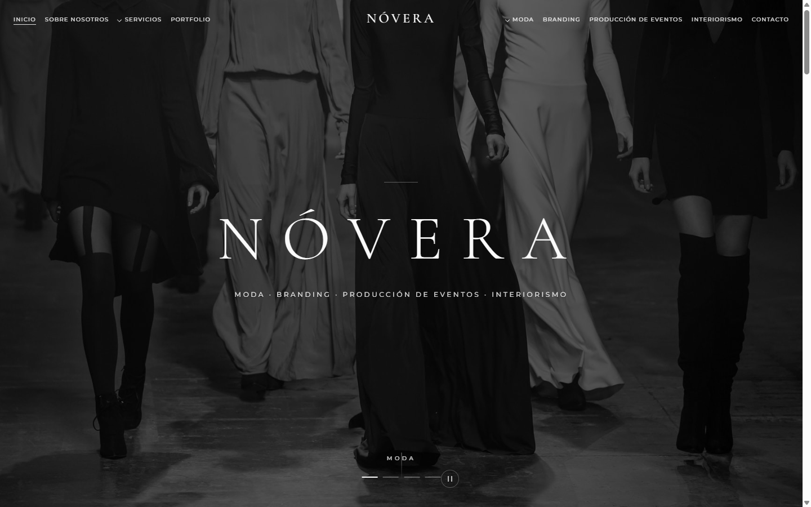

# NÓVERA — Web de ejemplo · Example website

**[ES](#español) | [EN](#english)**



---

## Español

### Qué es

Web corporativa de ejemplo para un estudio creativo multidisciplinar (moda, branding, producción de eventos, interiorismo, asistencia ejecutiva y arquitectura). Está hecha con **HTML, CSS y JavaScript puros**, sin frameworks ni proceso de compilación.

Sirve como demo y como punto de partida para montar la web de un estudio, agencia o marca de diseño: se copia, se cambian textos, imágenes y colores y se publica en cualquier hosting estático.

> **NÓVERA es una marca ficticia.** Textos, nombres, NIF, dirección, teléfono y correo son de ejemplo. Sustitúyelos por los tuyos antes de usarla en un proyecto real.

**Demo online:** https://ejemplo.danimefle.com (alojada en Cloudflare Pages; responde correctamente a 23-09-2026).

### Qué incluye

**14 páginas**

| Página | Fichero | Contenido |
|---|---|---|
| Inicio | `index.html` | Carrusel a pantalla completa con pausa, cinta de texto animada, introducción, 6 tarjetas de servicio, avance del portfolio y llamada a la acción |
| Sobre nosotros | `sobre-nosotros.html` | Cita destacada, filosofía, cifra destacada, línea de tiempo, equipo y valores |
| Servicios | `servicios.html` | Catálogo de las 6 disciplinas y ventajas de trabajar con el estudio |
| Moda | `moda.html` | Marcas propias (con modal «Próximamente»), colaboraciones, captación de talento con formulario, identidad de marcas y desfiles |
| Branding | `branding.html` | Página de servicio |
| Producción de eventos | `event-producer.html` | Página de servicio |
| Interiorismo | `interiorismo.html` | Página de servicio |
| Asistencia ejecutiva | `asistencia-ejecutiva.html` | Página de servicio |
| Arquitectura | `arquitectura.html` | Página de servicio |
| Portfolio | `portfolio.html` | Rejilla masonry con filtros por categoría y visor de imágenes (lightbox) |
| Contacto | `contacto.html` | Imagen, formulario y datos de contacto |
| Aviso legal | `aviso-legal.html` | Texto legal de ejemplo (LSSI-CE) |
| Política de privacidad | `politica-privacidad.html` | Texto legal de ejemplo (RGPD) |
| Política de cookies | `politica-cookies.html` | Texto de ejemplo y botón para cambiar el consentimiento |

Las 6 páginas de servicio siguen la misma estructura: cabecera con imagen, presentación, qué incluye, franja de imagen con cita, proceso de trabajo, galería y llamada a la acción.

**Funcionalidades (todas en `assets/script.js`)**

- Pantalla de precarga con el nombre de la marca.
- Barra de navegación transparente sobre la portada que se vuelve opaca al bajar, con desplegables.
- Menú móvil accesible: foco atrapado dentro, cierre con Escape y foco devuelto al botón.
- Carrusel de portada cada 6 s con botón de pausa; no rota solo si el sistema pide menos movimiento (`prefers-reduced-motion`).
- Animaciones de entrada al hacer scroll.
- Filtros del portfolio y visor de imágenes con teclado (←, →, Escape).
- Modal «Próximamente» en la página de Moda.
- Formularios de demostración: no envían nada (no hay backend); limpian los campos y muestran un mensaje de confirmación accesible.
- Banner de cookies: la analítica [Plausible](https://plausible.io) solo se carga si el visitante pulsa «Aceptar». La decisión se guarda en `localStorage` y se puede cambiar desde la política de cookies.

**Otros detalles**

- SEO: `title` y `description` propios en cada página, Open Graph, `canonical`, datos estructurados JSON-LD, `sitemap.xml`, `robots.txt`, favicons y `site.webmanifest`.
- Accesibilidad: HTML semántico con `header`/`main`/`footer`, enlace «Saltar al contenido», textos alternativos en las imágenes de fondo, foco visible y botones con estado ARIA.
- Seguridad: cabeceras CSP, HSTS, X-Frame-Options, Referrer-Policy y Permissions-Policy definidas en `_headers` (formato de Cloudflare Pages y Netlify).
- Imágenes en WebP (60 ficheros, unos 8,6 MB) y fuentes Cormorant Garamond y Montserrat incluidas en el repo (`assets/fonts/`).
- El código propio (HTML, CSS y JS) está comentado en español e inglés.

### Tecnologías

- HTML5, CSS3 y JavaScript (ES2020) sin librerías ni dependencias: no hay `package.json`.
- Node.js solo para el servidor local opcional `server.js`, que usa únicamente módulos nativos (`http`, `fs`, `path`). Probado con Node.js 24.21.0.
- Analítica opcional: Plausible, cargado desde `analytics.danimefle.com` solo tras aceptar las cookies.

### Cómo verla en local

No hace falta instalar nada ni compilar.

**Opción A: abrir el fichero.** Abre `index.html` en el navegador.

**Opción B: servidor local** (recomendado, porque así funcionan igual que en producción las rutas y las cabeceras de tipo de fichero). Con [Node.js](https://nodejs.org):

```bash
node server.js
# abre http://localhost:8080
```

O con Python, si lo prefieres:

```bash
python -m http.server 8080
```

### Personalización

| Qué cambiar | Dónde |
|---|---|
| Nombre de marca (`NÓVERA`) | Busca y reemplaza en los `.html`, `site.webmanifest` y `assets/script.js` |
| Colores y tipografías | Variables `:root` al principio de `assets/style.css` (tras los `@font-face`) |
| Textos y secciones | Cada `.html` tiene un comentario antes de cada bloque |
| Imágenes | `assets/img/` (WebP). Si cambias el nombre de un fichero, actualiza el `style="background-image:url(...)"` que lo usa |
| Datos de contacto | Pie de cada página, `contacto.html` y los JSON-LD |
| Dominio | `ejemplo.danimefle.com` aparece en los `.html` (`canonical`, Open Graph, JSON-LD), `sitemap.xml`, `robots.txt` y `assets/script.js` |
| Analítica | Función `cargarPlausible` de `assets/script.js` (`data-domain` y URL del script) y la CSP de `_headers`. Si no la usas, borra esa función y quita el dominio de la CSP |

### Estructura de carpetas

```
web-ejemplo/
├── index.html                  Inicio
├── sobre-nosotros.html         Sobre nosotros
├── servicios.html              Catálogo de servicios
├── moda.html                   Servicio: moda
├── branding.html               Servicio: branding
├── event-producer.html         Servicio: producción de eventos
├── interiorismo.html           Servicio: interiorismo
├── asistencia-ejecutiva.html   Servicio: asistencia ejecutiva
├── arquitectura.html           Servicio: arquitectura
├── portfolio.html              Portfolio con filtros
├── contacto.html               Contacto
├── aviso-legal.html            Aviso legal
├── politica-privacidad.html    Política de privacidad
├── politica-cookies.html       Política de cookies
├── assets/
│   ├── style.css               Todos los estilos
│   ├── script.js               Toda la interacción
│   ├── favicon.svg, favicon-32.png, apple-touch-icon.png
│   ├── fonts/                  Cormorant Garamond y Montserrat (woff2)
│   └── img/                    branding/, eventos/, ext/, extra/, moda/ y og-novera.jpg
├── docs/preview.png            Captura para este README
├── _headers                    Cabeceras de seguridad (Cloudflare Pages / Netlify)
├── site.webmanifest
├── sitemap.xml
├── robots.txt
├── server.js                   Servidor local opcional
└── LICENSE
```

### Publicarla

Al ser una web estática, basta con subir la carpeta a cualquier hosting: Cloudflare Pages, Netlify, GitHub Pages o un servidor propio con Nginx, Caddy o Apache. En hostings que no lean `_headers`, configura esas cabeceras en el servidor.

### Limitaciones conocidas

- `style.css` conserva estilos que ninguna página usa (formulario oscuro `.contact-form`, `.legal`, variantes de contacto, FAQ, mapa, bloque de socio). Se dejan a propósito como variantes de la plantilla y están marcados con el comentario «variante de plantilla, sin uso en esta demo».

### Licencia

[MIT](LICENSE) © 2026 Daniel Castaños Mefle. Las imágenes se incluyen solo como demostración; para un uso comercial sustitúyelas por material propio o con licencia.

---

## English

### What it is

A sample corporate website for a multidisciplinary creative studio (fashion, branding, event production, interior design, executive assistance and architecture). It's built with **plain HTML, CSS and JavaScript**, with no frameworks and no build step.

Use it as a demo or as a starting point for a studio, agency or design brand website: copy it, swap the copy, images and colors, and deploy it to any static host.

> **NÓVERA is a fictional brand.** All copy, names, tax ID, address, phone number and email are placeholders. Replace them with your own before using it for a real project.

**Live demo:** https://ejemplo.danimefle.com (hosted on Cloudflare Pages; confirmed up on 2026-09-23).

The site content is in Spanish.

### What's included

**14 pages**

| Page | File | Content |
|---|---|---|
| Home | `index.html` | Full-screen carousel with pause button, animated text strip, intro, 6 service cards, portfolio teaser and call to action |
| About us | `sobre-nosotros.html` | Pull quote, philosophy, highlighted figure, timeline, team and values |
| Services | `servicios.html` | Catalog of the 6 disciplines and reasons to work with the studio |
| Fashion | `moda.html` | Own brands (with a "Coming soon" modal), collaborations, talent scouting with a form, brand identity and runway shows |
| Branding | `branding.html` | Service page |
| Event production | `event-producer.html` | Service page |
| Interior design | `interiorismo.html` | Service page |
| Executive assistance | `asistencia-ejecutiva.html` | Service page |
| Architecture | `arquitectura.html` | Service page |
| Portfolio | `portfolio.html` | Masonry grid with category filters and an image viewer (lightbox) |
| Contact | `contacto.html` | Image, form and contact details |
| Legal notice | `aviso-legal.html` | Sample legal text (Spanish LSSI-CE law) |
| Privacy policy | `politica-privacidad.html` | Sample legal text (GDPR) |
| Cookie policy | `politica-cookies.html` | Sample text and a button to change consent |

The 6 service pages share the same structure: header image, intro, what's included, image strip with a quote, work process, gallery and call to action.

**Features (all in `assets/script.js`)**

- Preload screen with the brand name.
- Navigation bar that's transparent over the hero and turns solid on scroll, with dropdowns.
- Accessible mobile menu: focus trapped inside, Escape to close, focus returned to the button.
- Home carousel every 6 s with a pause button; it doesn't auto-rotate when the OS asks for reduced motion (`prefers-reduced-motion`).
- Entry animations on scroll.
- Portfolio filters and an image viewer with keyboard support (←, →, Escape).
- "Coming soon" modal on the Fashion page.
- Demo forms: nothing is sent (there's no backend); they clear the fields and show an accessible confirmation message.
- Cookie banner: [Plausible](https://plausible.io) analytics only loads after the visitor clicks "Accept". The choice is stored in `localStorage` and can be changed from the cookie policy page.

**Other details**

- SEO: unique `title` and `description` on every page, Open Graph, `canonical`, JSON-LD structured data, `sitemap.xml`, `robots.txt`, favicons and `site.webmanifest`.
- Accessibility: semantic HTML with `header`/`main`/`footer`, a "Skip to content" link, alt text for background images, visible focus and buttons with ARIA state.
- Security: CSP, HSTS, X-Frame-Options, Referrer-Policy and Permissions-Policy headers defined in `_headers` (Cloudflare Pages and Netlify format).
- WebP images (60 files, about 8.6 MB) and the Cormorant Garamond and Montserrat fonts bundled in the repo (`assets/fonts/`).
- All first-party code (HTML, CSS and JS) is commented in Spanish and English.

### Tech stack

- HTML5, CSS3 and JavaScript (ES2020) with no libraries or dependencies: there's no `package.json`.
- Node.js only for the optional local server `server.js`, which uses built-in modules only (`http`, `fs`, `path`). Tested with Node.js 24.21.0.
- Optional analytics: Plausible, loaded from `analytics.danimefle.com` only after cookies are accepted.

### Running it locally

Nothing to install or build.

**Option A: open the file.** Open `index.html` in your browser.

**Option B: local server** (recommended, so paths and content types behave the same as in production). With [Node.js](https://nodejs.org):

```bash
node server.js
# then open http://localhost:8080
```

Or with Python:

```bash
python -m http.server 8080
```

### Customization

| What to change | Where |
|---|---|
| Brand name (`NÓVERA`) | Find and replace in the `.html` files, `site.webmanifest` and `assets/script.js` |
| Colors and fonts | `:root` variables near the top of `assets/style.css` (after the `@font-face` rules) |
| Copy and sections | Every `.html` file has a comment before each block |
| Images | `assets/img/` (WebP). If you rename a file, update the `style="background-image:url(...)"` that points to it |
| Contact details | Footer of every page, `contacto.html` and the JSON-LD blocks |
| Domain | `ejemplo.danimefle.com` appears in the `.html` files (`canonical`, Open Graph, JSON-LD), `sitemap.xml`, `robots.txt` and `assets/script.js` |
| Analytics | The `cargarPlausible` function in `assets/script.js` (`data-domain` and script URL) and the CSP in `_headers`. If you don't need it, delete that function and remove the domain from the CSP |

### Folder structure

```
web-ejemplo/
├── index.html                  Home
├── sobre-nosotros.html         About us
├── servicios.html              Services catalog
├── moda.html                   Service: fashion
├── branding.html               Service: branding
├── event-producer.html         Service: event production
├── interiorismo.html           Service: interior design
├── asistencia-ejecutiva.html   Service: executive assistance
├── arquitectura.html           Service: architecture
├── portfolio.html              Portfolio with filters
├── contacto.html               Contact
├── aviso-legal.html            Legal notice
├── politica-privacidad.html    Privacy policy
├── politica-cookies.html       Cookie policy
├── assets/
│   ├── style.css               All styles
│   ├── script.js               All interactivity
│   ├── favicon.svg, favicon-32.png, apple-touch-icon.png
│   ├── fonts/                  Cormorant Garamond and Montserrat (woff2)
│   └── img/                    branding/, eventos/, ext/, extra/, moda/ and og-novera.jpg
├── docs/preview.png            Screenshot for this README
├── _headers                    Security headers (Cloudflare Pages / Netlify)
├── site.webmanifest
├── sitemap.xml
├── robots.txt
├── server.js                   Optional local server
└── LICENSE
```

### Deploying

It's a static site, so just upload the folder to any host: Cloudflare Pages, Netlify, GitHub Pages or your own Nginx, Caddy or Apache server. If your host doesn't read `_headers`, set those headers in the server config.

### Known issues

- `style.css` still contains styles no page uses (the dark `.contact-form`, `.legal`, contact variants, FAQ, map and partner block). They're kept on purpose as template variants and flagged with a "template variant, unused in this demo" comment.

### License

[MIT](LICENSE) © 2026 Daniel Castaños Mefle. The images are included for demo purposes only; for commercial use, replace them with your own or properly licensed assets.
